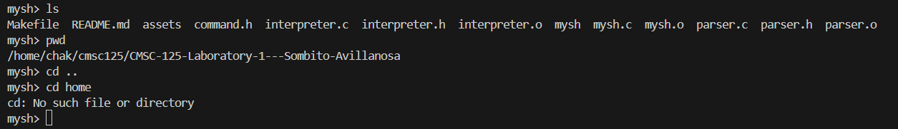
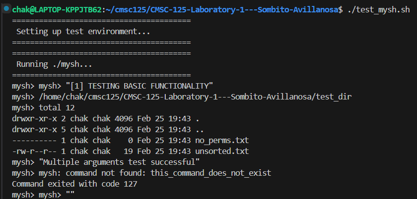

# CMSC-125-Laboratory-1---Sombito-Avillanosa

**Created by:**
 Chakinzo N. Sombito & Walton Karl L. Avillanosa

**INTRODUCTION**
 This repo contains implementation of Lab 1 for CMSC 125 Operating Systems, where we focus on process management and I/O redirection using the POSIX API in C.

The goal of this lab activity is to build a simplified Unix shell, called "mysh" to demonstrate how OS create and manage process, execute programs, handle input/output redirection, background execution.

The shell aims to demonstrate:
- Process creation using fork()
- Program execution using execvp()
- Parent-child process sync using wait() and waitpid()
- Input and output redirection using file descriptors
- Background job execution
- Cleanup of zombie processes

**FEATURES**
1. Interactive Shell
- Displaying a prompt (mysh >)
- Keep accepting and executing user commands
2. Built-in commands
- Implemented directly in the shell with no fork: (exit, cd <directory>, pwd)
3. External Command Execution
- Execute non-built in commands using: fork(), execvp(), wait()/waitpid()
4. I/O redirection
- Supports Output redirection: >
- Output append: >>
- Input redirection: <
- Combined redirection: < input.txt > output.txt
5. Background Execeution
- Supports commands ending with &
- Shell remains responsive
- Background jobs tracked to prevent zombie processes

**PROJECT STRUCTURE**
- assets/screenshots
- interpreter.c
- interpreter.h
- interpreter.o
- mysh.c
- mysh
- mysh.o
- parser.c
- parser.h
- parser.o
- test_mysh.sh
- README.md
- Makefile

**TESTING**
- Use test_mysh.sh for testing the UNIX Shell functionality

**COMPILATION AND USAGE INSTRUCTIONS**

How to use mysh.c File

1. Compile in terminal with command: "make all"
2. Run in terminal with command: "./mysh"

How to use test_mysh.sh
- test_mysh.sh is the test script to test the required functionality of this UNIX Shell

**DESIGN DECISIONS AND ARCHITECTURE OVERVIEW**

**Decisions:** 

1. We separated the parsing logic into parser.c to keep the main shell loop clean, and implemented a non-blocking waitpid loop at the start of each REPL iteration to reap zombies.

2. We also separated the logic in the mysh file to the interpreter c file. This ensures modularity and also ensures that mysh only handles input.

**SCREENSHOTS**

